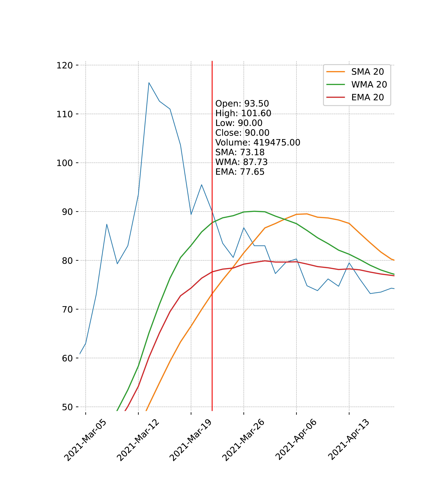

# PyMovePlot
## About
The library involves the development of software for time series analysis,
which enables the identification of trends, patterns, and forecasting of future
events based on data collected over time. The theoretical foundations of the
work are presented here, along with the developed library. It implements a
class that allows the display of a time series on a Matplotlib chart. Its goal
is to simplify the creation of programs intended for finance or production,
especially in the context of future forecasting. After loading the appropriate
data, it will display a chart containing that data. The chart will show moving
averages of a length chosen by the user. There is also a cursor that displays
values for a given discrete argument.

## File description
1. `Indicators`: The package responsible for the indicators displayed on the chart.
   - `Indicator.py`: Abstract class for stock market indices.
   - `MovingAverage.py`: Class that inherits from Indicator and which has a function that calculates one of three selected moving averages.
2. `Scraper`: The package responsible for downloading data from the network.
   - `PlotCollector.py`: A class that acts as a data store for previously downloaded data from the network.
   - `ScrapData.py`: Class responsible for retrieving data with a given name.
3. `View`: The package responsible for displaying and maintaining the chart.
   1. `GUI`: Package responsible for integrating Mplfinance with tkinker.
      - `Toolbar.py`: Class responsible for showing and hiding the default toolbar for matplotlib.
      - `Window.py`: The main class of the library, wraps matplotlib in a tkinker window.
   2. `Plot`: Package responsible for displaying data in Mplfinance and handling events related to it.
      - `AnnotatedCursor.py`: A class that creates a cursor that we use to move around the chart.
      - `Quotes.py`: The class creates an Mplfinance chart with selected indicators.
      - `ZoomPan.py`: Class that implements panning and zooming.

## Installation

After downloading the package, unpack it in a folder of your choice. Then, by calling the command
`pip install <package folder name>`in the terminal associated with a given python environment, it will install the 
package in that environment. Now all you need to do is import the main window `from PyMovePlot.View.GUI.Window 
import Window`.

## Example

To call the program window we need create class `Window()` We can pass the data that is to be displayed in the program 
via the constructor or via the `showData()` method. We can do this via the `data=` parameter, then we pass the DataFrame 
data in the format [Date,...]. he default format is [Date, Open, High, Low, Close]. If there are no other columns than 
Date, the data loader converts them to the default format. Averages and the default displayed column are calculated based
on the Close column. Another option for loading data is to use the internet API (`name=` parameter) and provide the name
in the format like: ticker symbol + "." + short country name e.g. "11B.PL", "EBAY.US". The last step is to call the 
`mainloop()` method responsible for the entire window startup.

### Example library call:
```python
 w = Window()
 test = pd.read_csv('data.csv', index_col='Date', parse_dates=['Date'])
 w.showData(data=test, period=20)
 w.mainloop()
```

### Displayed graph:

